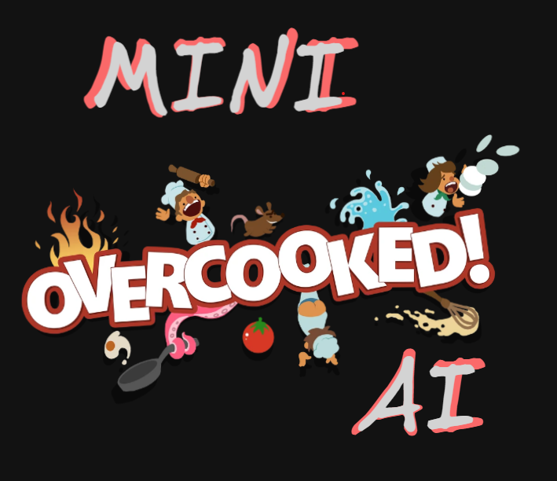
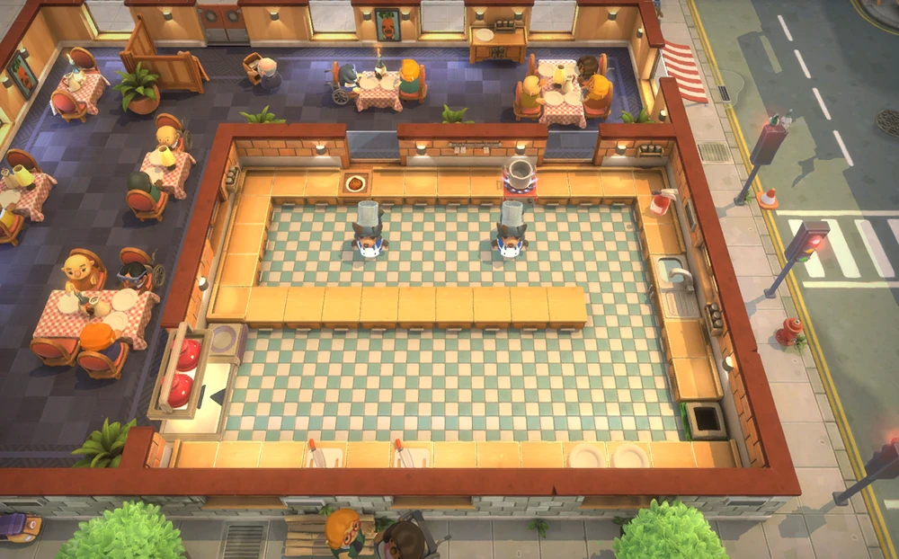
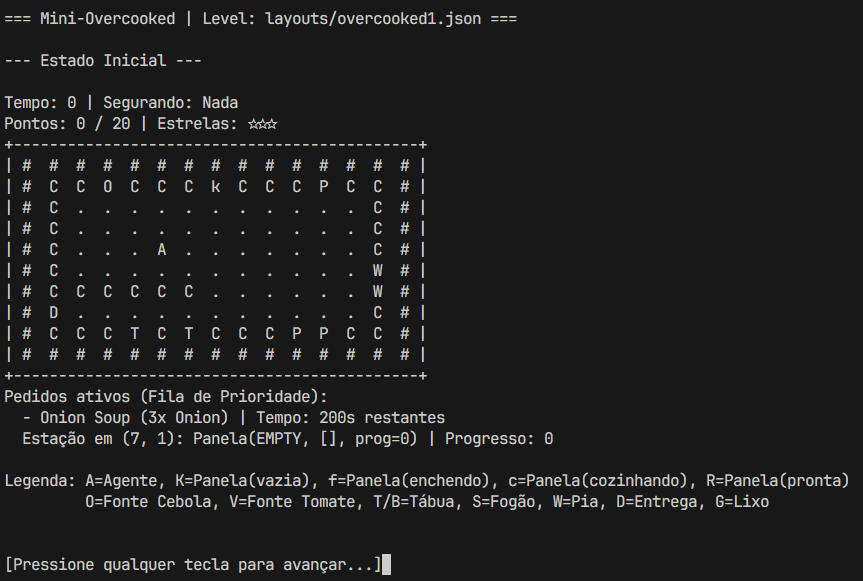

# Mini-Overcooked-AI

<p align="center">
  
</p>

Simulação do jogo Overcooked usando um **agente de busca heurística (A*)**. O agente planeja e executa ações em uma cozinha 2D para completar pedidos de pratos.

Projeto feito durante a disciplina de **Inteligência Artificial** ofertada pelo
Professor Dr. [Carlos Estombelo](https://buscatextual.cnpq.br/buscatextual/visualizacv.do;jsessionid=DE61ED8E3C1EC01F314A6D5A60311891.buscatextual_0) na Universidade Federal de Sergipe.

## Membros da Equipe

- [Alícia Vitória Sousa Santos](https://github.com/aliciasnts)
- [Gustavo Assunção do Amaral](https://github.com/redbdb)
- [Gustavo Henrique Aragão Silva](https://github.com/gustaaragao)
- [João Vitor Viana Felix](https://github.com/Jvvflx)
- [Jorge Henrique Marques Gomes](https://github.com/jorge2812)

## Mapa Inicial e Simulação (Terminal)

<p align="center">
  
  
</p>

## Simplificações do Projeto

Para viabilizar a modelagem em algoritmos de busca clássicos, o ambiente passou por algumas simplificações em relação ao *Overcooked* original (detalhado em [`docs/ESPECIFICAÇÃO.md`](docs/ESPECIFICAÇÃO.md)):

- **Apenas um cozinheiro**: a cozinha é operada por um único agente.
- **Ambiente Estático**: Os mapas não possuem obstáculos dinâmicos (como plataformas móveis ou pedestres).
- **Sem fila contínua de pedidos**: A fila de pedidos é carregada de forma inteira no início da fase e não chegam novos ao longo do tempo.
- **Panela fixa**: A panela (`K`) comporta múltiplos ingredientes para fazer sopas, mas não pode ser removida fisicamente do fogão.

## Estrutura

```
├── main.py                       # Ponto de entrada da simulação
├── env/kitchen_env.py            # Ambiente (Implementação da classe Environment do AIMA)
├── agents/kitchen_agent.py       # Agente + A* com limites
├── problems/kitchen_problem.py   # Problema de busca (Problem do AIMA)
├── models/                       # Entidades e estados (NamedTuples imutáveis)
├── utils/                        # Carregamento de dados e factory de estado
├── layouts/                      # JSONs dos 6 levels (1-1 a 1-6)
└── docs/                         # Documentação formal
```

## Pré-requisitos

### Python

O projeto utiliza **Python 3.9.25**, gerenciado via [pyenv](https://github.com/pyenv/pyenv).

```bash
# Instalar a versão correta do Python via pyenv
pyenv install 3.9.25

# A versão é lida automaticamente do arquivo .python-version
# Basta entrar no diretório do projeto
cd mini-overcooked-ai
python --version  # deve exibir Python 3.9.25
```

> O arquivo `.python-version` na raiz do projeto garante que o pyenv selecione a versão correta automaticamente.

### Dependências

```bash
# Criar e ativar virtualenv
python -m venv .venv

# Ativar o virtualenv
source .venv/bin/activate

# Instalar as dependências do projeto
pip install -r requirements.txt
```

**Dependências principais:**

| Pacote | Versão |
|--------|--------|
| `aima3` | 1.0.11 |

> `aima3` fornece as classes base `Problem`, `Environment` e `Agent` utilizadas no projeto.

## Execução

### Modo interativo (padrão)

Limpa a tela a cada passo e aguarda tecla para avançar. Salva cada estado em `out/step_NNN.txt` e o log completo em `out/render.txt`.

```bash
python main.py                          # Level 1-1 (padrão)
python main.py layouts/overcooked2.json # Outro level
```

### Modo automático (`--auto`)

Executa sem interação. Gera apenas `out/render.txt`.

```bash
python main.py --auto
python main.py layouts/overcooked2.json --auto
```

## Receitas dos Levels

| Level | Tipo | Prato(s) |
|-------|------|----------|
| 1-1 | Sopa | Sopa de Cebola (3× cebola → panela) |
| 1-2 | Sopa | Cebola, Tomate, Mista |
| 1-3 | Sopa | Igual 1-2 (sem pia) |
| 1-4 | Hambúrguer | Simples, com Alface, com Tomate, Completo |
| 1-5 | Sopa | Cebola e Tomate (cozinha dividida) |
| 1-6 | Hambúrguer | Simples, com Tomate, Completo (cozinha maior) |

## Tiles do mapa

| Tile | Descrição |
|------|-----------|
| `O` | Fonte infinita de cebola |
| `V` | Fonte infinita de tomate |
| `T`/`B` | Tábua de corte |
| `K` | **Panela** (multi-ingrediente) |
| `S` | Fogão simples (1 ingrediente) |
| `W` | Pia |
| `D` | Entrega |
| `P` | Prato inicial |
| `G` | Lixeira |

## Documentação

- [`docs/ESPECIFICAÇÃO.md`](docs/ESPECIFICAÇÃO.md) — especificação formal do problema (AIMA)